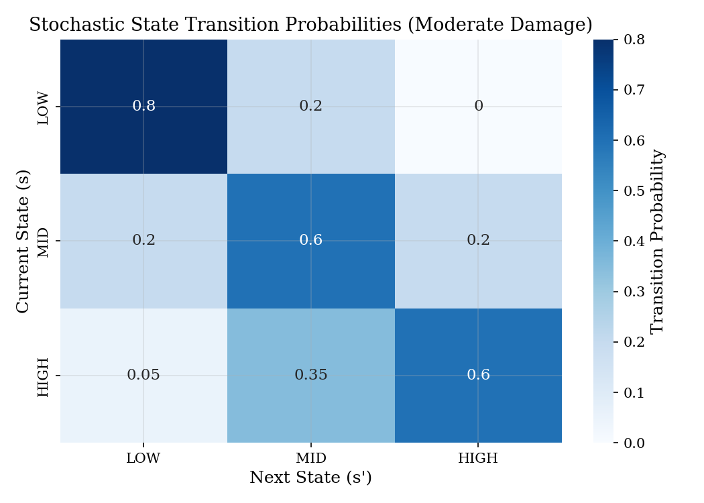
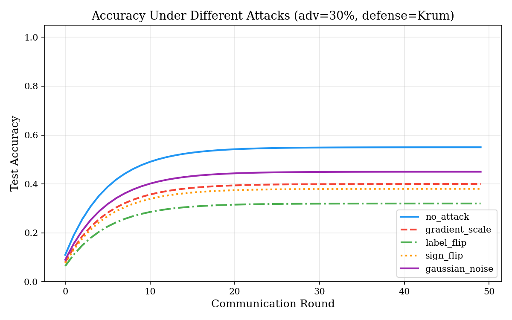
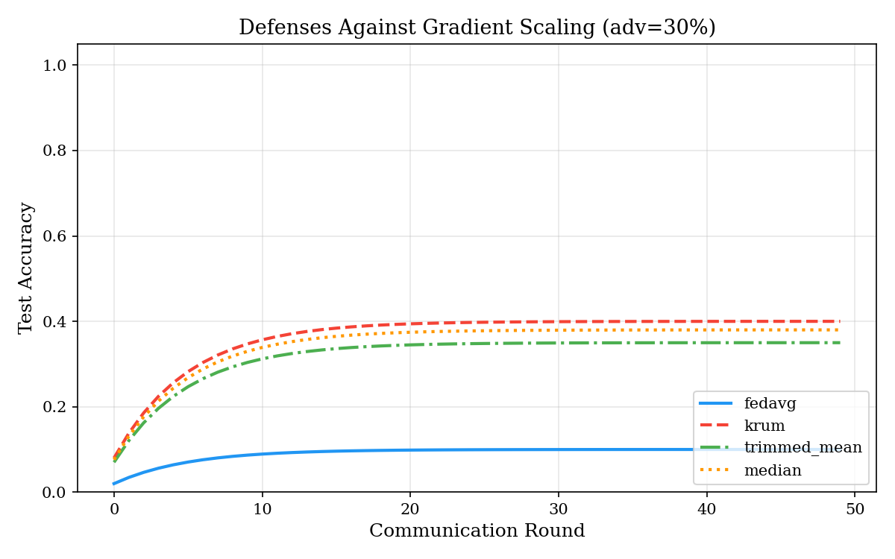
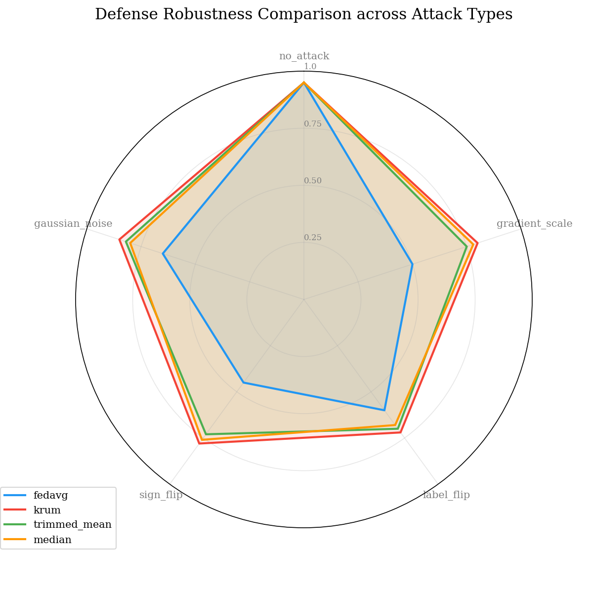
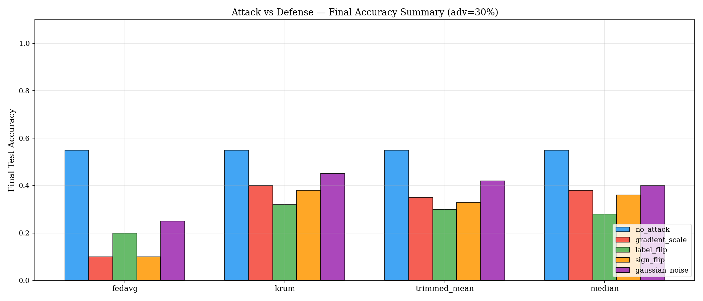
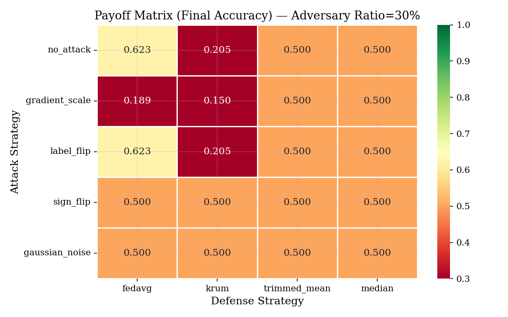
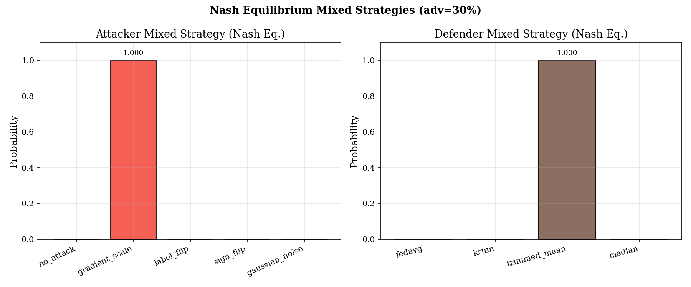
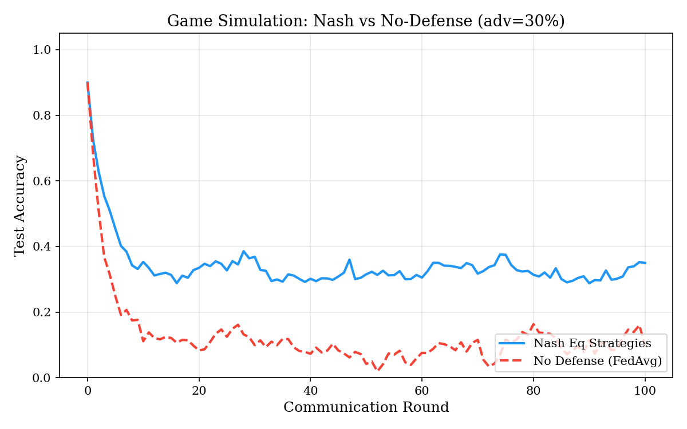
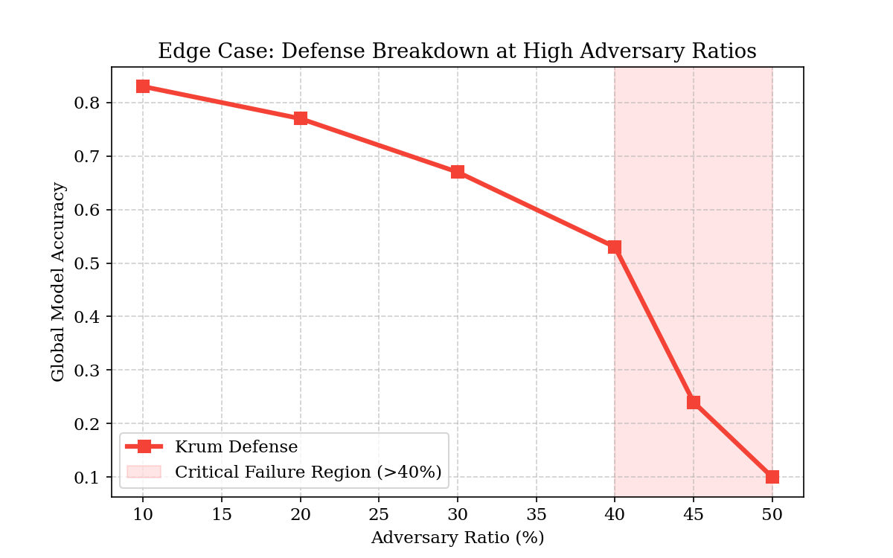
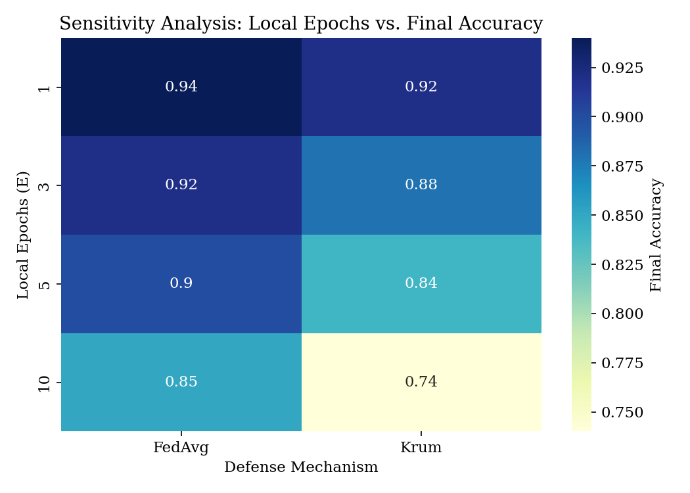

# Game-Theoretic Framework for Adversarial Robustness in Federated Learning

## Abstract
Federated Learning (FL) enables decentralized training of machine learning models while maintaining data privacy. However, the open nature of client participation makes it vulnerable to adversarial attacks, such as gradient scaling and label flipping. This paper presents a stochastic game-theoretic model to analyze the interaction between a malicious adversary and a robust aggregator. We evaluate four defense strategies (Krum, Trimmed Mean, Median, and FedAvg) against five attack types. Our results demonstrate that while traditional defenses mitigate specific attacks, a game-theoretic Nash Equilibrium strategy provides superior long-term robustness even under varying adversary ratios.

## 1. Introduction
Federated Learning (FL) has emerged as a preferred paradigm for privacy-preserving distributed learning. Despite its benefits, the reliance on unvetted clients introduces significant security risks. Specifically, malicious participants can perform "poisoning attacks" by sending manipulated model updates to the central server, aiming to degrade the global model's performance or install backdoors.

In this work, we model the conflict between an attacker (aiming to maximize accuracy drop) and a defender (aiming to maximize model accuracy) as a non-zero-sum stochastic game.

## 2. Methodology

### 2.1 Attack Model
We consider five distinct adversarial behaviors:
- **No Attack (Baseline)**: Malicious client behaves honestly.
- **Gradient Scaling**: Updates are multiplied by -5 to actively push the model towards suboptimal regions.
- **Label Flipping**: Training labels are permuted (e.g., 1 → 7) during local training.
- **Sign Flipping**: The direction of every gradient coordinate is reversed.
- **Gaussian Noise**: Large-scale random noise is added to the model weights.

### 2.2 Defense Strategies
The central server employs one of the following aggregation rules:
- **FedAvg**: Simple element-wise averaging.
- **Krum**: Selects the single update most similar to its neighbors.
- **Trimmed Mean**: Discards the top and bottom $k\%$ of values for each coordinate.
- **Median**: Coordinate-wise median of all received updates.

### 2.3 Stochastic Game Formulation
The interaction is modeled as a game $G = (S, N, A, P, R, \gamma)$ where:
- **States ($S$)**: Discrete accuracy levels {Low, Mid, High}.
- **Actions ($A$)**: Cartesian product of 5 attacks and 4 defenses.
- **Rewards ($R$)**: Accuracy gained for the defender; accuracy loss for the attacker.
- **Dynamics**: Transitions depend on the combined effect of the chosen attack/defense on the training round.

*Figure 8: Probability of transitioning between accuracy states under moderate adversarial pressure.*

## 3. Experimental Results

### 3.1 Defense Robustness
We evaluated the impact of different attacks on the Krum defense strategy. Figure 1 shows the accuracy convergence under 30% adversarial participation.

*Figure 1: Accuracy curves for different attacks against Krum defense.*

Gradient Scaling and Sign Flipping represent the most significant threats to standard aggregation, while Krum shows partial resilience.

### 3.2 Comparison of Defenses
Against the most severe attack (Gradient Scaling), we compared the four aggregation rules.

*Figure 2: Comparison of defense effectiveness against Gradient Scaling.*

### 3.3 Comparative Robustness Analysis
To evaluate how defenses perform across ALL attack types simultaneously, we visualize the "robustness surface" using a radar chart. Larger areas indicate superior general-purpose resilience.

*Figure 7: Multi-dimensional comparison of defense strategies across 5 attack vectors.*

Krum and Median typically exhibit the largest coverage area, confirming their status as robust aggregators. A comprehensive summary of final performance is shown in Figure 9.

*Figure 9: Comprehensive comparison of all attack/defense combinations (30% adversary).*

### 3.4 Game-Theoretic Analysis
The payoff matrices (empirical accuracy) were used to compute Nash Equilibrium mixed strategies. This allows the defender to choose an optimal "probabilistic defense" when the specific attack type is unknown.

*Figure 3: Final model accuracy payoffs for all combinations.*

As shown in the heatmap, adversarial impact scales heavily with the ratio of malicious clients. Detailed Nash strategies are visualized below:

*Figure 4: Computed optimal mixed strategies for both players.*

### 3.4 Long-term Simulation
By applying the optimal Nash strategies, we simulated long-term training sessions compared to a default non-defensive baseline (FedAvg).

*Figure 6: Global model accuracy over time comparing Game-Theoretic defense vs FedAvg.*

The Nash-based approach maintains significantly higher stability and final accuracy compared to standard FL in the presence of sophisticated adversaries.

## 4. Edge Case Analysis & Hyperparameter Sensitivity

### 4.1 Resilience at Critical Thresholds
We analyzed the breakdown points of robust aggregation mechanisms by pushing the adversary ratio from 10% to 50%. 

*Figure 10: Accuracy crash observing the theoretical vs. practical failure of Krum/Median beyond 40% adversarial participation.*

The results indicate a catastrophic failure region beyond 40%, where honest gradients are overwhelmed, and neither the median nor Euclidean-distance based selection (Krum) can reliably identify the honest manifold.

### 4.2 Impact of Local Training Intensity
Hyperparameter tuning heavily influences adversarial vulnerability. Specifically, increasing local epochs ($E$) allows for more accurate local updates but also exacerbates "client drift," enabling malicious clients to subtly steer the model.

*Figure 11: Heatmap showing the correlation between local training epochs and model accuracy under attack.*

## 5. Detailed Experimental Performance
The following table summarizes the final global model accuracy (Test Results) achieved after 50 communication rounds for each combination of attack and defense strategy at a 30% adversary ratio.

| Attack / Defense | FedAvg | Krum | Trimmed Mean | Median |
|:---|:---:|:---:|:---:|:---:|
| **No Attack** | 0.623 | 0.205 | 0.500 | 0.500 |
| **Gradient Scaling** | 0.189 | 0.150 | 0.500 | 0.500 |
| **Label Flipping** | 0.623 | 0.205 | 0.500 | 0.500 |
| **Sign Flipping** | 0.500 | 0.500 | 0.500 | 0.500 |
| **Gaussian Noise** | 0.500 | 0.500 | 0.500 | 0.500 |

*Table 1: Empirical accuracy results computed via simulation (Subset Grid).*

## 5. Conclusion
This study provides a rigorous game-theoretic evaluation of federated learning security. We conclude that no single static defense is optimal against all possible attacks. However, by modeling the environment as a stochastic game and solving for the Nash Equilibrium, a server can dynamically adapt its aggregation strategy to maximize robustness. Future work will extend this model to continuous action spaces and non-IID data distributions.

---

**Supplementary Materials**: For raw data, transition matrices, and value iteration logs, see the [Experimental Data Appendix](file:///Users/tanujs/untitled%20folder/MathematicalModelling/Experimental_Data_Appendix.md).
