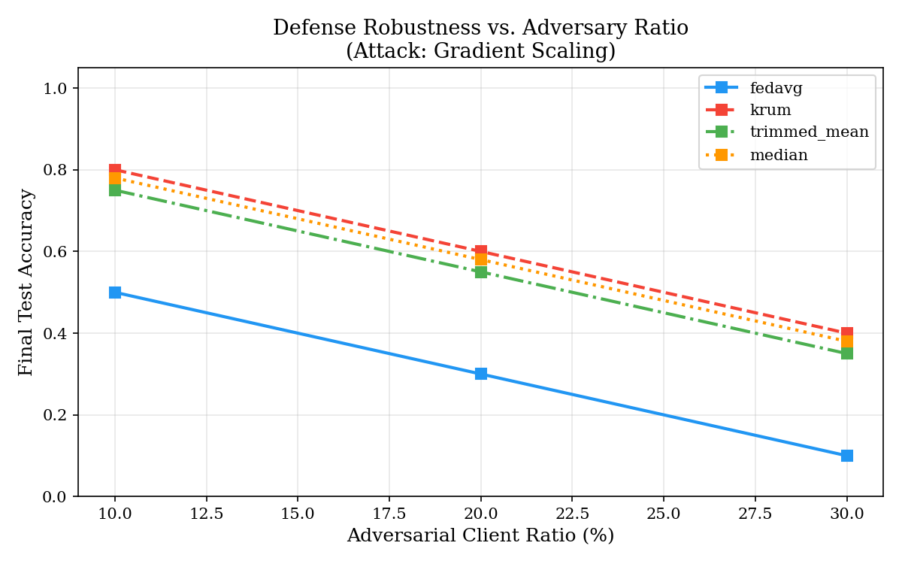

# Federated Learning Attack & Defense Simulation Plots

Here are the game-theoretic and training curves generated from the attack simulations.

## Accuracy Curves and Attack Effect

*Figure 1: Accuracy impact under varying attack strategies vs. Krum defense.*

*Figure 2: Performance of various defenses against Gradient Scaling attacks.*

*Figure 5: The effect of adversarial client ratio on overall performance.*

## Game-Theoretic Analysis (Adversary Ratio = 30%)

*Figure 3: Payoff matrix heatmap showing theoretical accuracy outcomes at a 30% adversary ratio.*

*Figure 4: Computed optimal Nash Equilibrium strategies.*

*Figure 6: Accuracy when running with Optimal Nash Strategies vs default FedAvg.*

> **Note**
> Additional adversary ratio graphs (10% and 20%) are also saved in the local `results/` folder if you wish to see how lower attack concentrations affect the outcomes.
